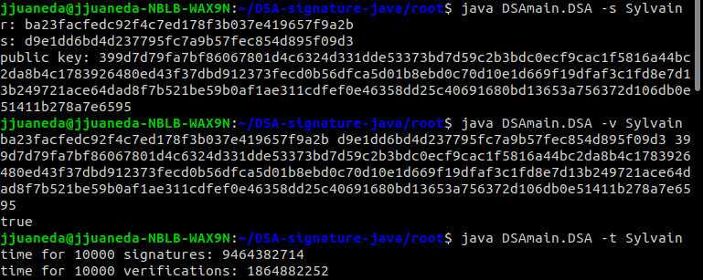

DSA-signature-java
==================

This repository contains a java implementation of a DSA Signature based on NIST recommendations from FIPS 186-3.

Usage
-----

To Download this repository use   `git clone https://github.com/JuJuaneda/DSA-signature-java`

Then Use `cd DSA-signature-java/root` to get to the root folder.

Compile the project with `javac DSAmain/DSA.java`

Do `java DSAmain.DSA` for default execution of the program. This returns a signature of "SylvainDuquesne" and the associated public key.

This program can be used with four different options : 

    -s or --sign <data> returns a signature and its associated public key for the given data. 
                        "SylvainDuquesne" if no data was given. 
  
    -v or --verif <data r s publicKey> verifies that the given signature is valid for the given data and public key. 
                                       Arguments r,s and publicKey must be given as hexadecimals.
  
    -t or --time <data> returns the time needed to do 10000 signatures and the time needed to do 10000 verifications of data. 
                        "SylvainDuquesne" if no data was given. Time is returned as nanoseconds.
  
    -h or --help opens helper  

**Warning** : Use only one option at a time.

Detailed Workings
-----------------

In the root folder are two packages:

org.apache.commons.cli which is a package from the Apache API used for the parsing of the command line. For more informations about this package go to https://commons.apache.org/proper/commons-cli/

DSAmain is the main package of this program, it contains the following classes :

DSA is the main class of the program, it contains the main method that runs the program.

optionParser is a class that only contains a building method that parses the command line and returns an optionParser object that contains the values of the different arguments given as inputs.

executionTime is also a class that only contains a building method. This building method creates an executionTime object that is made of the time needed for _int_ signature and the Time needed for _int_ verification of _data_ where _int_ and _data_ are the inputs given to this method.

The signature class has three BigInteger constants L = 2^160 + 7, P = 1 + (2^160 + 7)(2^864 + 218) and G = 2^((P-1)/L) mod P. A signature object has four parameters which are all BigInteger objects:  
  
  * data which contains the hashed data to be signed

  * r which contains the r value of the signature.

  * s whcih contains the s value of the signature.

  * publicKey which contains the public key associated with the private key used to generate the signature.

To build a signature object there are two options:

  * The first builder only takes an argument byte[] data. The given data is then hashed using MD5 (I chose to use MD5 because I worked on a project about that hash function and also because the goal of this implementation is only 80 bits of security using a more secured hash is not necessary) and the resulting hash is then stored as a BigInteger in the data parameter of the newly created signature object. Next, a key pair and a random value k are generated, the public key is stored in the publicKey argument, the private key and value k are used along with the previously defined constants to compute values r and s. Finally the method makes sure that neither r nor s is equal to zero.

  * The second builder takes four arguments: data (a byte[] object), r, s and publicKey (BigInteger objects). It returns a signature object with the MD5 hash of data and the given r s and publicKey as parameters. (This builder is only used to create a signature object to be verified for the verif option thus it doesn't check that neither r nor s are equal to zero as the following verif() method already does that).

Finally a signature object has a method verif() which verifies if the signature object it is applied to is valid or not. To do so it first checks that values r and s are strictly comprised between 0 and L. Then it computes value r using s,publicKey,P,L and G and checks if the computed value is indeed equal to r.

Example
-------

This example was done using an Ubuntu 20.04.4 with an Intel core i7 processor with 8 CPUs and a 15 GiB RAM.
